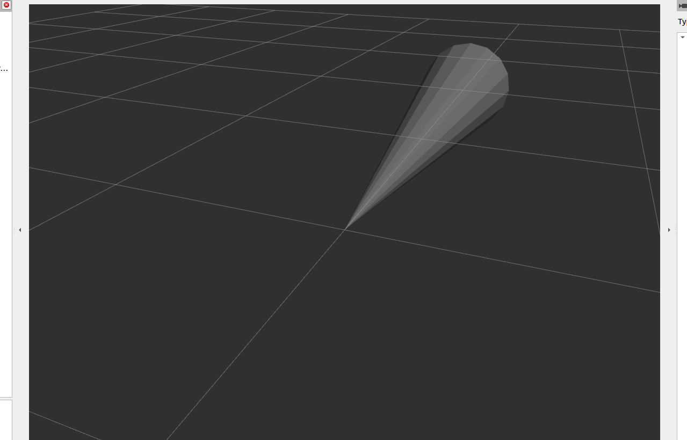

# ultrasonic_bridge

A ROS 2 package for bridging raw ultrasonic sensor data from a microcontroller to ROS 2, converting it into a standard `sensor_msgs/Range` message for visualization in RViz.



## Features

- Receives distance data (in cm) from a microcontroller (e.g., Arduino) via the `ultrasonic_distance` topic.
- Publishes standardized `sensor_msgs/Range` messages on the `ultrasonic_range` topic.
- Ready-to-use RViz configuration for visualizing ultrasonic range data.

## Package Structure

- [`ultrasonic_bridge/ultrasonic_bridge.py`](ultrasonic_bridge/ultrasonic_bridge.py): Main ROS 2 node implementation.
- [`ultrasonic.ino`](ultrasonic.ino): Example Arduino firmware for publishing distance data.
- [`config/ultra.rviz`](config/ultra.rviz): RViz configuration file.
- [`launch/ultrasonic.launch.py`](launch/ultrasonic.launch.py): Launch file to start the bridge node and RViz.

## Requirements

- ROS 2 Humble or later
- Python 3.10+
- Microcontroller running Micro-ROS (see `ultrasonic.ino`)

## Installation

Clone this repository into your ROS 2 workspace `src` directory and build:

```sh
cd ~/ros2_ws/src
git clone <this-repo-url> ultrasonic_bridge
cd ~/ros2_ws
colcon build
source install/setup.bash
```

## Usage

1. Flash your microcontroller with [`ultrasonic.ino`](ultrasonic.ino) and connect it to your ROS 2 machine.
2. Launch the bridge node and RViz:

```sh
ros2 launch ultrasonic_bridge ultrasonic.launch.py
```

3. View the ultrasonic sensor data in RViz.

## Testing

Run the included linters and tests:

```sh
colcon test --packages-select ultrasonic_bridge
```

## License

See [package.xml](package.xml) for license information.

## Maintainer

edwin (<edwin_george@alphadroid.io>)